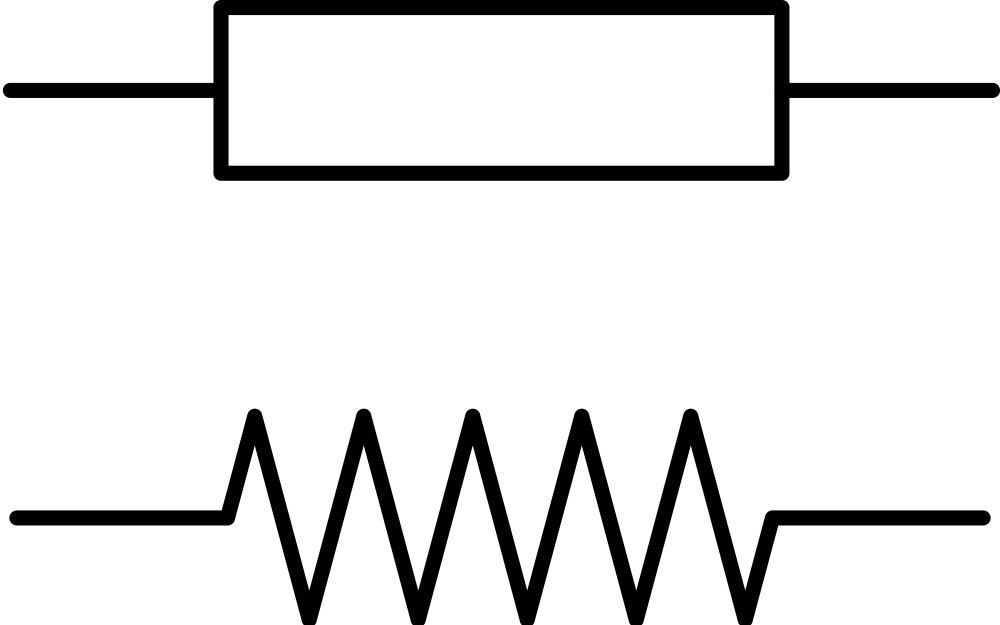
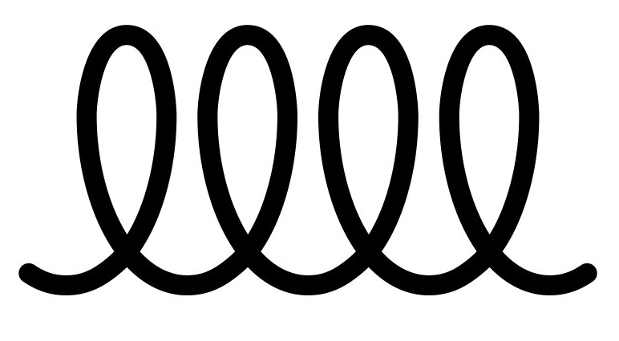
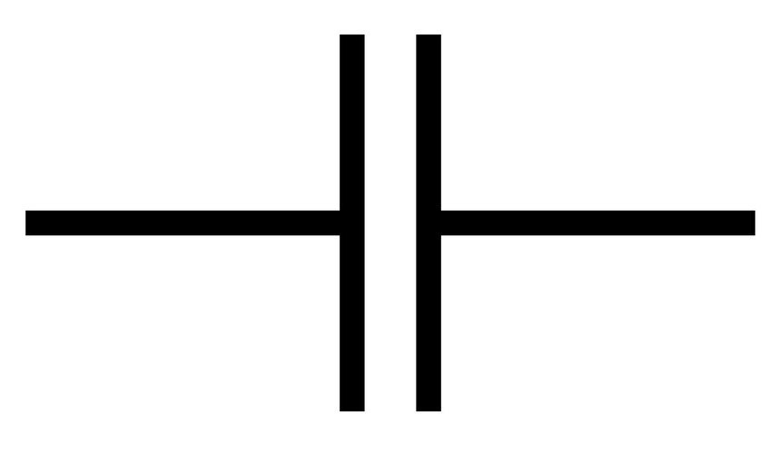
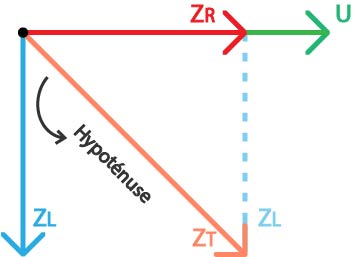

# Impédence $Z$ & $\underline{Z}$

L'impédance $Z$ est une grandeur complexe qui caractérise la résistance d'un circuit électrique au passage d'un courant alternatif. Elle combine la résistance $R$ (partie réelle) et la réactance $X$ (partie imaginaire), et s'exprime en ohms ($\Omega$).

Elle est donnée par la relation :  
$$Z = R + jX$$  
où $j$ est l'unité imaginaire ($j^2 = -1$).

L'impédance dépend de la fréquence $\frac{1}{T}$ du signal et des composants du circuit (résistances, inductances, et capacités).

### Exemples de composants électroniques

**Résistances**

Une résistance est souvent utilisée pour limiter le courant dans un circuit.

    

Unité : $\Omega$ (Ohm)

**Inductances**

Un exemple de composant électronique pour une inductance est une **bobine d'inductance**, utilisé dans les filtres ou les circuits oscillants.

    

Unité : $H$ (Henry)

**Capacités**

Un exemple de composant électronique pour une capacité est un **condensateur céramique** ou un **condensateur électrolytique**, utilisé pour stocker de l'énergie ou filtrer des signaux.

    

Unité : $F$ (Farad)

## Formules

### Résitance : $Z_R$

Non complexe :
$$Z_R = R$$

Complexe :
$$|Z_R| = [R ; 0]$$

### Bobines : $Z_L$ 

Non complexe :
$$Z_L = L * \omega$$ 

Complexe :
$$\mathbf{\underline{Z}}_L = j *L * \omega$$

$$|Z_L| = [L\omega ; \frac{\pi}{2}]$$

> rappel : $\omega = 2\pi * f$

### Condensateur : $ Z_C $

Non complexe :
$$Z_C = \frac{1}{\omega * c}$$

Complexe :
$$\mathbf{\underline{Z}}_C = -j\frac{1}{\omega * c}  = \frac{-j}{\omega * c}$$

$$|Z_C| = [\frac{1}{C\omega} ; -\frac{\pi}{2}]$$

### Impédence totale : $ Z_T $

$$Z_T = Z_L + Z_R + Z_C$$

## Calculs

### Impédance R & L : $Z_T = Z_R + Z_L$

On va utiliser le théoreme de pythagore : $a^2 + b^2 = c^2$

donc $c = \sqrt{a^2 + b^2}$

Pour representer un calcul complexe $\mathbb{C}$ il est plus simple d'utiliser un schéma :

    

> à noter que : U = 0° // R = 0° // L = -90° // C = 90°

$Z_T$ represente l'hypoténuse, $Z_R$ & $Z_L$ sont des côtés (oposé où adjacent)

On va reprendre la formule de Pythagore : $c = \sqrt{a^2 + b^2}$ : 

$$a = Z_R \qquad b = Z_L \qquad  c = Z_T$$

ce qui nous donne :

$$Z_{T} =  \sqrt{(Z_R)^2 + (Z_L)^2}$$
$$=  \sqrt{(R)^2 + (L\omega)^2}$$
$$=  \sqrt{R^2 + (L *2\pi * f)^2}$$

